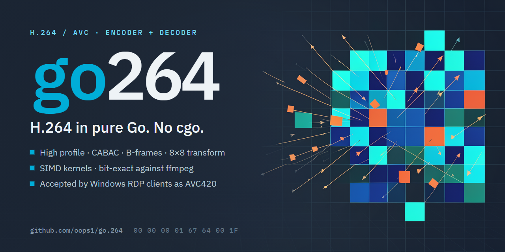

# go264

H.264/AVC encoder and decoder in pure Go. No cgo, ever.

- **CGO-free.** Builds and passes its full test suite with `CGO_ENABLED=0` on
  every supported platform. No C toolchain, no shared-library link step.
- **Verified against a reference implementation.** The decoder reproduces
  ffmpeg's output bit for bit on the checked-in conformance streams, and
  ffmpeg decodes the encoder's output bit for bit to what our own decoder
  produces. Both directions are measured, not assumed.
- **Hardware acceleration when present.** The encoder and decoder probe for
  platform video engines at construction time and use them when available,
  falling back to the CPU path transparently. Bindings go through syscalls
  and `dlopen`, never cgo.

## Status

Working today:

| Area | State |
| --- | --- |
| Decoder, High profile | complete, bit-exact against ffmpeg on twenty-nine clips |
| Encoder, High profile | the 8x8 transform, Intra_8x8 and the scaling matrices |
| Intra prediction | all block sizes in both directions, 4x4, 8x8 and 16x16 |
| Inter prediction | all P partitions both directions, 8x8 sub-macroblocks, multiple references |
| B slices | both directions: bi-prediction, spatial direct, output reordered by picture order count |
| Weighted prediction | explicit for predictive slices, explicit and implicit for bi-predictive |
| Supplemental enhancement information | recovery point, buffering period, picture timing and user data, both directions |
| CAVLC | complete, both directions |
| CABAC | complete in both directions; streams are 18 to 30 per cent smaller than CAVLC |
| In-loop deblocking filter | complete, shared by encoder and decoder |
| Reference picture management | sliding window and the memory management operations in both directions, including long-term references |
| Rate-distortion quantisation | 4.8 to 7.1 per cent of the bitrate at equal quality; 1.2 dB worse on screen content, so leave it off there |
| Level selection | from the picture size, the reference count, the bitrate and the buffer |
| Slices | any count, encoded in parallel; ten times faster on twenty threads for 2 to 12 per cent more bits, depending on how much the picture moves |
| Hardware acceleration | encoding on Windows through Media Foundation, on 64-bit Linux through NVENC and VA-API with nothing to import - NVENC proven on an RTX 5060 Ti, VA-API on Intel Gen9 through the free iHD driver; decoding on Windows through Direct3D, nine times our own decoder at 1080p. No cgo on any path |
| Bitrate targeted rate control | complete, and under a buffer model the long run rate never exceeds the request |
| Constant quality | a rate factor on the quantiser scale instead of a bit budget, 1.9 dB better than a fixed quantiser at the same rate over a ten second screencast session |
| Complexity estimate | taken from the source pictures before the encode, so it does not know the quantiser, for 0.6 per cent of the encode |
| Adaptive quantisation | by macroblock variance, and off by default: it costs 1.8 dB at equal rate on scrolling text, which is what a remote desktop carries |
| Mode decision | rate-distortion, with an early skip test that pays for itself six times over on screen content |
| SIMD kernels | transformed differences, six-tap and bilinear interpolation, block matching, the 4x4 transform and quantisation |
| Scaling matrices | resolved and applied in both directions; the JVT defaults save 8 to 18 per cent of the bits |
| Intra refresh | a sweeping band of intra macroblocks, motion constrained so the refreshed area is never reinfected |
| Deblocking control | on, off, or kept inside slices, with both offsets |
| Buffer model | a coded picture buffer with a constant bitrate mode, announced to the decoder |
| Lossless transform bypass | rejected explicitly, in both directions |

See [docs/ROADMAP.md](docs/ROADMAP.md) for what comes next and why in that
order, [docs/PLAN.md](docs/PLAN.md) for the phase breakdown and
[docs/ARCHITECTURE.md](docs/ARCHITECTURE.md) for the design.

## Install

```
go get github.com/oops1/go.264
```

### Hardware encoding on Linux

On amd64 and arm64 Linux the codec carries both backends itself, so there
is nothing to import. Whenever a configuration allows, the encoder tries
NVENC, then VA-API (Intel and AMD), then the processor. 32-bit Linux has
no hardware backend, because purego does not run there.

Both load their libraries at run time through purego, so the build stays
`CGO_ENABLED=0`. purego reaches those libraries through the system's
dynamic loader, which makes a Linux program that links go264
dynamically linked against glibc, even without cgo. Where that matters - a
`scratch` or Alpine image, a single static binary - build with
`-tags go264_nohwaccel`: the backends are left out, the binary stays
static, and the encoder always uses the processor. `ForceSoftware` in
`EncoderConfig` does the same at run time for one encoder.

Before v1.9.0 the backends were the separate modules
`github.com/oops1/go.264/hwaccel/vaapi` and `.../hwaccel/nvenc`. A program
that still imports one keeps working, because a backend registered twice
is used once, but the import and its `require` line should go.

VA-API needs `libva.so.2` and `libva-drm.so.2` and a
driver that offers `VAEntrypointEncSlice` or `VAEntrypointEncSliceLP` for
an H.264 profile, which `vainfo` will show; the full one is preferred when
both exist, and `LIBVA_DRIVER_NAME` chooses between installed drivers as it
does for any libva program. Before handing an encoder over, the VA-API
backend encodes a test frame and decodes it back, so a driver that
advertises an entry point it cannot drive is refused rather than trusted.
The process needs read and write access to a `/dev/dri/renderD*` node.

A driver can also abort inside libva, which no recover can catch - i965 on
a Coffee Lake machine did exactly that, asserting while the context was
created.
So the first time a process opens the VA-API encoder, it tries the driver
in a child process first: the program's own binary is run again with
GO264_VAAPI_PROBE set and no arguments, the backend's init sees it, opens
the encoder, encodes the test frame and exits before main. If the child is
killed or hangs, VA-API is not used again in that process. A machine with
no `/dev/dri/renderD*` node never starts the child. The init functions of
other packages in the program run in the child too, so keep them free of
side effects, or build with `go264_nohwaccel`.

Construction falls back to the processor silently, so check which path you
got rather than assuming:

```go
enc, err := go264.NewEncoder(cfg)
// enc.Backend() is "vaapi", "nvenc", "mediafoundation" or "cpu"
```

A hardware encoder carries the picture size, frame rate, GOP length,
quantiser and, where the backend has rate control, the bitrate - and
nothing else. VA-API encodes at a constant quantiser. Any setting only the
processor path implements - IntraRefresh, Trellis, long-term references,
weighted prediction, temporal direct, deblocking control, the buffer model -
keeps the encoder on the processor. ForceKeyFrame reaches the VA-API
encoder, which starts a new GOP at the next picture; NVENC and Media
Foundation do not honour it yet, so there a key frame comes only at the
end of the GOP.

Every IDR carries the sequence and picture parameter sets whichever path
produced it: the processor encoder always writes them, and if a hardware
driver sends them only once, the encoder remembers them and puts them back
in front of each later IDR. `RepeatParameterSets` adds them at intra refresh
recovery points as well, which is the only thing it changes, so on its own
it no longer keeps the encoder on the processor.

The NVENC backend has encoded on real hardware: its whole test suite, fifty
tests, passes on two RTX 5060 Ti cards under WSL2 with driver 580.97, and
ffmpeg decodes what it writes identically to our own decoder. That is the
Windows driver passed through to WSL, not the Linux driver on bare metal.
The VA-API backend has encoded on a Coffee Lake UHD 630 through Debian's
free iHD driver and its low-power entry point, with HuC firmware loaded by
i915.enable_guc=2, and ffmpeg reads what it writes without a warning. It
has not met an AMD driver.

## Library

```go
enc, err := go264.NewEncoder(go264.EncoderConfig{
    Width:  1920,
    Height: 1080,
    FPSNum: 30, FPSDen: 1,
    GOPSize: 60,
    QP:      26,
})
if err != nil {
    return err
}
defer enc.Close()

packet, err := enc.Encode(i420Frame)
```

```go
dec := go264.NewDecoder()
defer dec.Close()

frames, err := dec.Decode(annexB)
for _, f := range frames {
    i420 = f.AppendI420(i420[:0])
}
```

`Encoder.Backend()` and `Decoder.Backend()` report which implementation is
actually in use, and `ForceSoftware` pins the CPU path for reproducibility.

## Command line

```bash
go install github.com/oops1/go.264/cmd/go264@latest
```

```bash
go264 encode -s 1280x720 -qp 24 -gop 30 -i input.yuv -o output.264
```

Or aim at a bitrate instead of a fixed quantiser:

```bash
go264 encode -s 1280x720 -b 2500 -gop 30 -i input.yuv -o output.264
```

Or hold the quality rather than either of them:

```bash
go264 encode -s 1280x720 -crf 23 -gop 30 -i input.yuv -o output.264
```

```bash
go264 decode -i input.264 -o output.yuv
```

Input and output default to standard input and output, so the tool composes
with ffmpeg:

```bash
ffmpeg -i movie.mp4 -pix_fmt yuv420p -f rawvideo - | go264 encode -s 1280x720 -o out.264
```

## Rate control

Three modes, one at a time.

**A fixed quantiser.** `QP`, or `-qp`. Every picture is quantised the same
way, so the quality follows the content and the bitrate follows both.

**A bitrate.** `BitrateKbps`, or `-b`. The quantiser moves to hold the
average rate. Adding `VBVBufferKbits` and `VBVMaxrateKbps` puts a real coded
picture buffer underneath it, announced to the decoder, and `CBR` pads the
stream so the buffer never overflows.

**A rate factor.** `RateFactor`, or `-crf`, on the same 0 to 51 scale as the
quantiser. There is no bit budget: the quantiser follows how hard the
picture is to code, along a curve flat enough that an easy picture is not
coded wastefully and a hard one is not starved. `RateFactor` and
`BitrateKbps` together are a configuration error, but `RateFactor` with
`VBVMaxrateKbps` is not, and is the useful combination: constant quality
under a ceiling the channel can carry.

Three knobs shape the curve, and the defaults are the ones measured on
screencast material rather than libx264's, which were tuned for film.
`QComp` is how much of a complexity swing reaches the quantiser: 0 lets all
of it through, which is constant bitrate, and 1 lets none through, which is
a fixed quantiser. It defaults to 0.8 rather than libx264's 0.6: over a mixed
session both keep the same gain, but at 0.8 the frame to frame spread runs
0.7 dB wider than a fixed quantiser's where at 0.6 it runs 1.6 dB wider.
`IPRatio` (1.4) is how much finer a key picture is
quantised than a predicted one, and `PBRatio` (1.3) how much coarser a
bi-predictive one. Leaving any of the three at zero takes the default.

The complexity the curve follows is measured before the picture is coded,
by matching each macroblock against the previous source picture, so it
never learns anything about the quantiser and cannot drift with it. Two
limits still hold it: the quantiser never goes more than six steps below
the rate factor, because dropping it on a near still screen makes
macroblocks that were skippable against the old reference unskippable and
refreshes the whole picture for nothing, and it moves no more than four
steps between pictures, which is libx264's `qp_step`.

What the mode does not do is steady the quality. Compressing the complexity
curve gives a busy scene a coarser quantiser than a quiet one, so across
scenes of different complexity the spread widens rather than narrows; it
narrows only on a clip whose scenes keep changing, where it holds 3.3 dB of
frame to frame variation against a fixed quantiser's 3.5. If what you want
is the steadiest possible quality, a fixed quantiser is already that.

**Adaptive quantisation** is separate from all three and off by default.
`AQMode = AQVariance`, or `-aq 1`, varies the quantiser inside each picture
by macroblock variance, spending the finer quantiser on detail and the
coarser one on flat areas, with the offsets taken against the picture's own
mean so they cancel. `AQStrength` (1.0) scales them. It is off because it
does not pay on this material: on scrolling text it is 1.8 dB worse at equal
rate than simply lowering the quantiser everywhere, for the reason
[docs/ROADMAP.md](docs/ROADMAP.md) records. Leave it off unless you have
measured your own content and found otherwise.

## Verification

Every numeric table taken from the specification is transcribed from an
authoritative source and then validated structurally rather than trusted.
For the CAVLC tables that means asserting each is a prefix free code whose
Kraft sum is at or just below one, which caught seven wrong entries in one
table and a chroma table whose sum exceeded one, an arithmetic
impossibility for any prefix code.

The decoder is measured against frames ffmpeg produces from the same
streams, sample for sample. The encoder is measured the other way: ffmpeg
must decode its output to exactly what our own decoder produces. Assembly
kernels are compared against their pure Go twins on randomised inputs.

The arithmetic decoder is held to the same standard from the other side.
Its tests carry a CABAC encoder written from the specification and round
trip randomised bin sequences through it, along with every syntax element
the Main profile needs, so that a stream that fails to decode points at
the surrounding code rather than at the arithmetic.
Prediction and interpolation are compared against independent reference
implementations written from the specification formulas rather than from
the production code.

## Testing

```bash
go test ./...
```

The conformance suite decodes the streams under `testdata/conformance` and
compares every sample against frames produced by ffmpeg. `testdata/regen.sh`
regenerates that corpus. Tests that shell out to ffmpeg skip themselves when
it is not installed.

## License

BSD 2-Clause. See [LICENSE](LICENSE).
